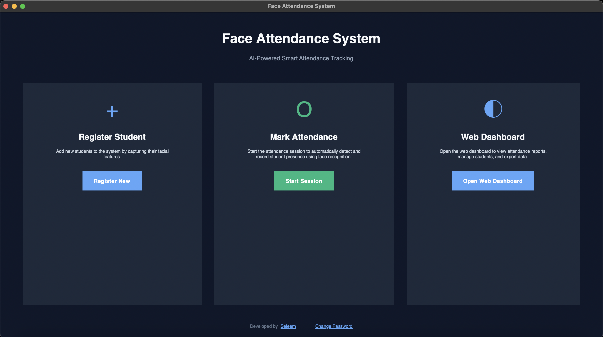
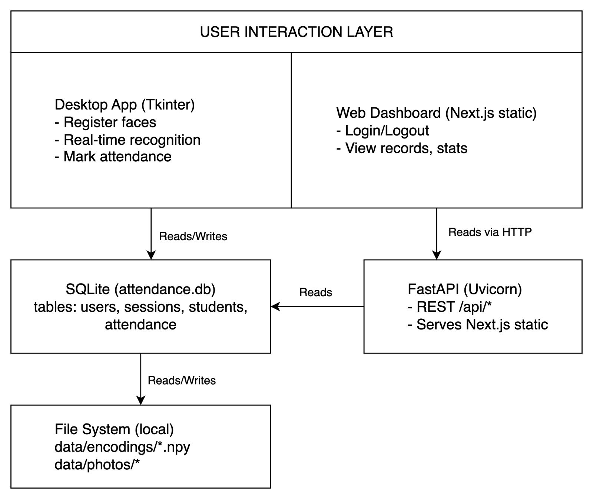

# Face Attendance System

AI-powered face recognition attendance system with desktop app and web dashboard. Built with Python (OpenCV, face_recognition), FastAPI, and Next.js.

This is a complete attendance tracking solution that combines a desktop application for face registration and real-time attendance marking with a web dashboard for viewing records, generating reports, and managing data. Everything runs locally on a single machine—no cloud services required.



## Table of Contents

- [Overview](#overview)
- [Features](#features)
- [Architecture](#architecture)
- [Technology Stack](#technology-stack)
- [Installation](#installation)
- [Development Setup](#development-setup)
- [Building the Application](#building-the-application)
- [Usage](#usage)
- [Project Structure](#project-structure)
- [Design Decisions](#design-decisions)
- [License](#license)

## Overview

The Face Attendance System solves a common problem: tracking attendance efficiently without manual sign-in sheets or card swipes. Instead, it uses facial recognition to automatically identify and mark students as present.

The system is designed as a **hybrid local-first application**:

- **Desktop app** handles the heavy lifting: face capture, encoding, and real-time recognition using computer vision
- **Web dashboard** provides a clean interface for viewing attendance data, generating reports, and analyzing trends
- **Backend API** connects the web dashboard to the same database the desktop app uses
- Everything runs on **localhost**—your data never leaves your machine

This architecture was chosen because attendance data is sensitive, and running everything locally gives you complete control and privacy. Plus, you don't need an internet connection once everything is set up.

## Features

### Desktop Application

- **Face Registration**: Capture multiple photos of each student to build accurate face encodings
- **Real-time Attendance**: Start a session and automatically detect faces, marking attendance as students appear
- **Duplicate Prevention**: Students can't be marked twice on the same day
- **Camera Selection**: Automatically detects and uses available cameras
- **Admin Authentication**: Login required before accessing registration or attendance features
- **Password Management**: Change admin password securely with bcrypt hashing

### Web Dashboard

- **Authentication**: Secure login with session-based authentication
- **Dashboard Overview**: View today's attendance stats, total students, and attendance rate
- **Attendance Records**: Browse attendance by date with a date picker
- **Data Visualization**: See weekly attendance trends and percentages
- **Responsive Design**: Works on desktop and tablet devices

### Backend API

- **RESTful Endpoints**: Clean API for all attendance and student data
- **Session Management**: Secure cookie-based sessions with expiration
- **CORS Configured**: Ready for web dashboard integration
- **Static File Serving**: Serves the Next.js dashboard directly
- **Database Initialization**: Automatically creates tables and seeds default admin user

## Architecture

The system follows a three-layer architecture:



### User Interaction Layer

**Desktop App (Python + Tkinter)**

- Built with Python's Tkinter for the GUI—it's cross-platform and comes bundled with Python
- Uses OpenCV for camera access and face detection
- Leverages the `face_recognition` library (built on dlib) for face encoding and matching
- Directly writes to SQLite database and file system (no API calls needed)
- Handles all face recognition operations locally for speed and privacy

**Web Dashboard (Next.js Static)**

- Next.js with static export for zero server-side dependencies
- Uses shadcn/ui components for a consistent, accessible UI
- Communicates with FastAPI backend via HTTP requests
- All data fetching happens client-side with React hooks

### Backend Layer

**FastAPI (Uvicorn)**

- Runs **in-process** within the desktop application—no separate server process needed
- Started automatically when you open the web dashboard
- Provides REST API endpoints for the web dashboard
- Also serves the static Next.js build files
- Handles authentication, session management, and database queries

**Why in-process?** This simplifies deployment. Users don't need to manually start a server or worry about port conflicts. The desktop app manages everything.

### Data Storage Layer

**SQLite Database**

- Single `attendance.db` file in the `db/` directory
- Tables: `users`, `sessions`, `students`, `attendance`
- File-based database means easy backup (just copy the file)
- No database server required

**File System**

- `data/encodings/`: NumPy arrays storing face encodings (`.npy` files)
- `data/photos/`: Original photos captured during registration (`.jpg` files)
- Encodings are averaged from multiple samples for better accuracy

## Technology Stack

### Desktop Application

- **Python 3.12**: Core language
- **Tkinter**: GUI framework (built into Python)
- **OpenCV (cv2)**: Computer vision library for camera access and image processing
- **face_recognition**: Python wrapper around dlib for face detection and encoding
- **dlib**: C++ library for facial landmark detection
- **NumPy**: Numerical operations for encoding arrays
- **bcrypt**: Password hashing (better than hashlib for passwords)
- **sqlite3**: Database operations (built into Python)

### Backend API

- **FastAPI**: Modern Python web framework with automatic API documentation
- **Uvicorn**: ASGI server for FastAPI
- **Pydantic**: Data validation and serialization
- **bcrypt**: Password hashing (same as desktop for consistency)

### Web Dashboard

- **Next.js 15**: React framework with static export
- **TypeScript**: Type-safe JavaScript
- **Tailwind CSS**: Utility-first CSS framework
- **Lucide React**: Icon library
- **Sonner**: Toast notifications

### Build & Packaging

- **PyInstaller**: Python application bundling
- **npm**: Node.js package manager for web dashboard

## Installation

### Prerequisites

#### macOS

- Python 3.11 or 3.12
- Xcode Command Line Tools: `xcode-select --install`
- Homebrew (recommended): `brew install python3`
- Node.js 18+ and npm

#### Windows

- Python 3.11 or 3.12 (64-bit)
- Visual C++ Build Tools (for dlib/face_recognition)
- Node.js 18+ and npm

### Step 1: Clone the Repository

```bash
git clone https://github.com/Saleem-devs/face-attendance-system.git
cd face-attendance-system
```

### Step 2: Set Up Python Environment

**macOS/Linux:**

```bash
python3 -m venv env
source env/bin/activate
```

**Windows:**

```bash
python -m venv env
env\Scripts\activate
```

### Step 3: Install Python Dependencies

```bash
pip install --upgrade pip
pip install -r requirements.txt
```

**Note**: Installing `dlib` and `face_recognition` can take a few minutes. On Windows, you may need to install Visual C++ Build Tools first.

### Step 4: Set Up Web Dashboard

```bash
cd web_dashboard
npm install
```

### Step 5: Build the Web Dashboard

```bash
npm run build
```

This creates a static export in `web_dashboard/out/` that will be served by FastAPI.

### Step 6: Run the Application

**For Development:**

1. Start the desktop app:

   ```bash
   cd desktop
   python main.py
   ```

2. The backend will start automatically when you click "Open Web Dashboard"
3. Access the dashboard at `http://localhost:8000`

**Default Login:**

- Username: `admin`
- Password: `admin123`

**⚠️ Important**: Change the default password immediately after first login!

## Development Setup

### Project Structure

```
face-attendance-system/
├── desktop/                 # Desktop application
│   ├── main.py             # Entry point
│   ├── core/               # Face recognition logic
│   │   ├── registration.py
│   │   └── attendance.py
│   ├── ui/                 # UI components
│   │   ├── theme.py
│   │   ├── login_view.py
│   │   └── change_password_view.py
│   ├── services/           # Business logic
│   │   ├── auth.py
│   │   └── backend_manager.py
│   └── assets/            # Icons, images
│
├── backend/                # FastAPI backend
│   ├── main.py            # FastAPI app
│   ├── database.py        # DB connection & init
│   ├── routes/            # API endpoints
│   │   ├── auth.py
│   │   ├── students.py
│   │   ├── attendance.py
│   │   └── stats.py
│   ├── services/          # Business logic
│   │   ├── auth_service.py
│   │   ├── session_service.py
│   │   ├── student_service.py
│   │   └── attendance_service.py
│   └── middleware/        # Auth middleware
│
├── web_dashboard/         # Next.js frontend
│   ├── src/
│   │   ├── app/           # Next.js app router
│   │   ├── components/    # React components
│   │   └── lib/          # Utilities
│   └── out/              # Static build output
│
├── data/                  # Generated data
│   ├── photos/           # Student photos
│   └── encodings/        # Face encodings
│
├── db/                    # Database
│   └── attendance.db     # SQLite database
│
└── docs/                  # Documentation
    └── architecture/     # Architecture diagrams
```

### Running Tests

Currently, the project doesn't include automated tests. Manual testing workflow:

1. **Registration Flow**: Register a new student, verify photos and encodings are saved
2. **Attendance Flow**: Start attendance session, verify recognition works
3. **Web Dashboard**: Login, view stats, check attendance records
4. **Authentication**: Test login, logout, password change

## Building the Application

### macOS

1. **Build the web dashboard first** (if not already built):

   ```bash
   cd web_dashboard
   npm run build
   cd ..
   ```

2. **Build the macOS app**:

   ```bash
   pyinstaller "Face Attendance System.spec"
   ```

3. **Find your app**:

   ```
   dist/Face Attendance System.app
   ```

4. **First Run**: On first launch, macOS will ask for camera permission. Grant it to use face registration.

5. **Distribution**: Right-click the app → Compress → Share the `.zip` file. Recipients may need to:
   - Right-click → Open (first time only)
   - Or run: `xattr -dr com.apple.quarantine "Face Attendance System.app"`

### Windows

1. **Build the web dashboard first** (if not already built):

   ```bash
   cd web_dashboard
   npm run build
   cd ..
   ```

2. **Build the Windows executable**:

   ```bash
   pyinstaller "Face Attendance System (Windows).spec"
   ```

3. **Find your executable**:

   ```
   dist/Face Attendance System/
   ```

4. **Distribution**: Zip the entire `Face Attendance System` folder and share.

**Note**: Windows users may need to allow camera access through Windows Privacy Settings.

## Usage

### Registering a Student

1. Launch the desktop app and login
2. Click "Register New Student"
3. Enter student details:
   - **Name**: Full name
   - **Student ID**: Unique identifier
   - **Email**: Optional
4. Click "Start Face Capture"
5. Position the student in front of the camera
6. The app will capture 5 photos automatically
7. Wait for "Registration successful" message

<!--  -->

**Tips for Best Results**:

- Ensure good lighting
- Face the camera directly
- Remove glasses/masks if possible
- Keep a neutral expression

### Marking Attendance

1. Click "Start Session"
2. Position students in front of the camera
3. The app will automatically detect and mark attendance
4. A message will appear for each recognized student
5. Click "Stop Session" when done

<!--  -->

**Features**:

- Students already marked today won't be marked again
- Unrecognized faces display a message
- All attendance is saved with timestamps

### Viewing Records

1. Click "Open Web Dashboard"
2. Login with admin credentials
3. View today's stats on the dashboard
4. Use the date picker to view attendance for specific dates
5. See weekly trends in the stats section

<!--  -->

### Changing Password

1. Click "Change Password" link in the footer
2. Enter current password
3. Enter new password twice
4. Click "Change Password"

## Design Decisions

### Why SQLite?

SQLite is perfect for single-user applications. It's:

- **Zero configuration**: No server setup needed
- **File-based**: Easy to backup (just copy the file)
- **Fast**: More than enough for attendance records
- **Reliable**: ACID-compliant, battle-tested

For a multi-user or cloud deployment, you'd want PostgreSQL or MySQL, but for local-first, SQLite is ideal.

### Why Direct Database Access from Desktop?

The desktop app writes directly to SQLite instead of going through an API. This decision was made because:

- **Performance**: Face recognition is CPU-intensive; avoiding HTTP overhead matters
- **Simplicity**: No need to serialize face encodings over HTTP
- **Reliability**: No network latency or connection issues

The web dashboard uses the API because it's a separate process and needs structured data access.

### Why In-Process Backend?

Running FastAPI inside the desktop app process:

- **Simpler deployment**: One executable, not two processes
- **Easier for users**: No manual server management
- **Port management**: Desktop app handles port conflicts
- **Resource efficient**: Shared Python interpreter

The alternative would be spawning a subprocess, but in-process threading is cleaner.

### Why face_recognition Library?

The `face_recognition` library (built on dlib) was chosen because:

- **Proven**: Used in production by many projects
- **Accurate**: Good balance of speed and accuracy
- **Python-friendly**: Easy to integrate
- **Local**: No API calls needed

Alternatives like AWS Rekognition or Azure Face API require internet and cost money. For local-first, `face_recognition` is perfect.

### Why Separate Desktop and Web?

This hybrid approach gives the best of both worlds:

- **Desktop**: Fast, native UI for camera operations
- **Web**: Modern, responsive interface for data viewing
- **Shared Data**: Both access the same database

## Project Structure Deep Dive

### Desktop Application

**`desktop/main.py`**

- Entry point for the desktop app
- Creates the main window and handles navigation
- Manages backend startup/shutdown
- Handles login flow

**`desktop/core/registration.py`**

- Face capture logic
- Camera initialization with OpenCV
- Multiple photo capture (5 samples)
- Face encoding generation and averaging
- Database writes for student records

**`desktop/core/attendance.py`**

- Real-time face recognition loop
- Loads all student encodings on startup
- Compares detected faces against known encodings
- Marks attendance with duplicate prevention
- Handles camera selection and error recovery

**`desktop/services/auth.py`**

- Password hashing with bcrypt
- User authentication
- Database initialization for users table
- Password change functionality

**`desktop/services/backend_manager.py`**

- Manages FastAPI/Uvicorn server lifecycle
- Starts server in background thread
- Handles port checking
- Opens browser for dashboard

### Backend API

**`backend/main.py`**

- FastAPI application setup
- CORS configuration
- Router registration
- Static file serving
- Database initialization on startup

**`backend/database.py`**

- SQLite connection management
- Table creation functions
- Context manager for connections
- Path resolution for PyInstaller bundles

**`backend/routes/`**

- RESTful endpoint definitions
- Request/response models
- Authentication dependencies

**`backend/services/`**

- Business logic separate from routes
- Database queries
- Data transformation
- Session management

### Web Dashboard

**`web_dashboard/src/app/`**

- Next.js App Router structure
- `page.tsx`: Login page
- `dashboard/page.tsx`: Main dashboard

**`web_dashboard/src/lib/api.ts`**

- API client functions
- Cookie handling for sessions
- Error handling

**`web_dashboard/src/components/ui/`**

- shadcn/ui components
- Reusable UI elements

## Troubleshooting

### Camera Not Working

**macOS:**

- System Settings → Privacy & Security → Camera → Enable for app
- Or run: `xattr -dr com.apple.quarantine "Face Attendance System.app"`

**Windows:**

- Settings → Privacy → Camera → Allow desktop apps

### Port 8000 Already in Use

The backend tries to use port 8000. If it's occupied:

1. Close other applications using port 8000
2. Or modify `backend_manager.py` to use a different port

### Face Recognition Not Working

- Ensure good lighting
- Face the camera directly
- Make sure student was registered with clear photos
- Check that encodings exist in `data/encodings/`

### Database Errors

- Ensure `db/` directory exists
- Check file permissions
- Verify SQLite is working: `sqlite3 db/attendance.db ".tables"`

### Build Errors

**PyInstaller:**

- Ensure all dependencies are installed
- Check that `web_dashboard/out` exists (build web dashboard first)
- On macOS, may need to allow PyInstaller in System Settings

**Next.js:**

- Clear `.next` cache: `rm -rf web_dashboard/.next`
- Reinstall dependencies: `rm -rf node_modules && npm install`

## Contributing

Contributions are welcome! Please:

1. Fork the repository
2. Create a feature branch
3. Make your changes
4. Test thoroughly
5. Submit a pull request

## License

See [LICENSE](LICENSE) file for details.

## Acknowledgments

- [face_recognition](https://github.com/ageitgey/face_recognition) library by Adam Geitgey
- [FastAPI](https://fastapi.tiangolo.com/) by Sebastián Ramírez
- [Next.js](https://nextjs.org/) by Vercel
- [shadcn/ui](https://ui.shadcn.com/) components

---

Built with ❤️ by [Saleem](https://github.com/Saleem-devs)
